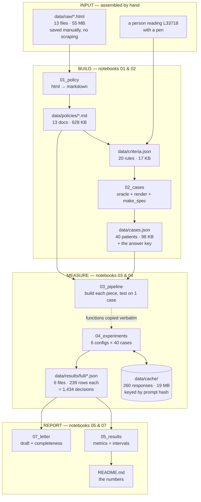
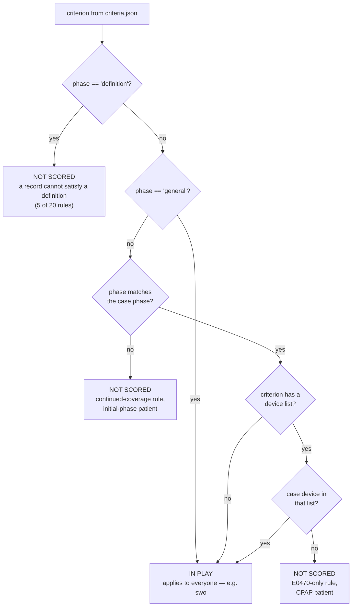
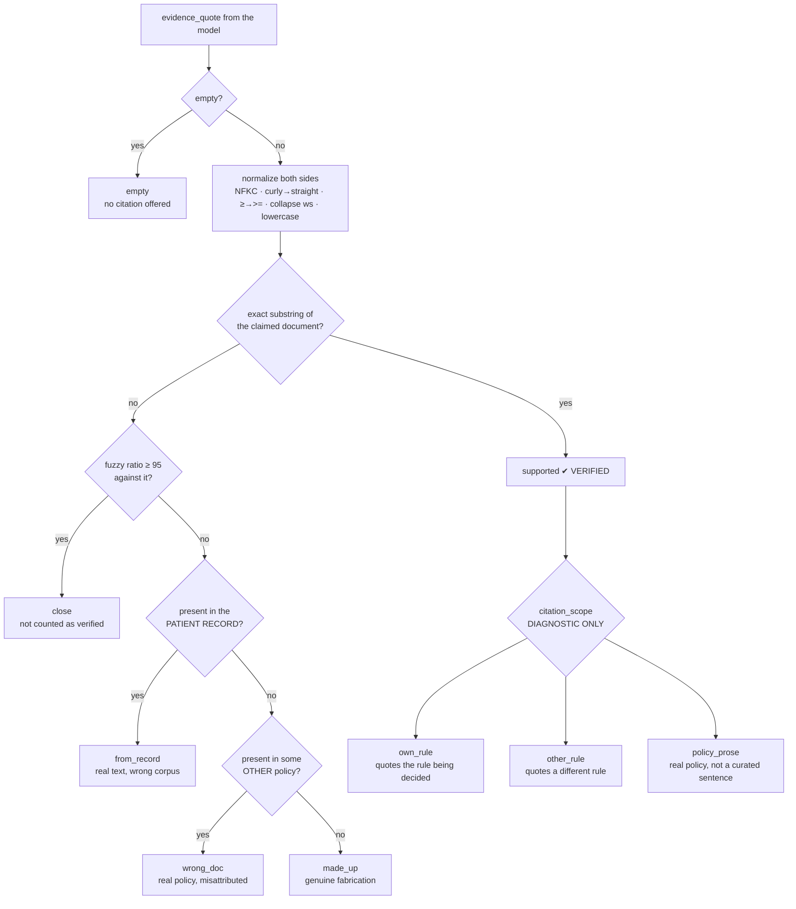
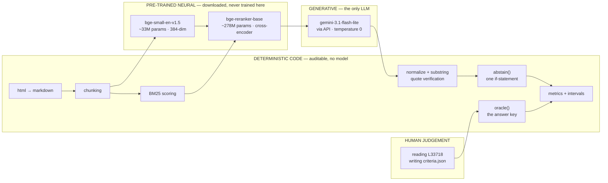

# The system as diagrams

Every flow in the project, with the technical detail attached. Mermaid blocks render on GitHub;
ASCII blocks are used where exact data shapes matter more than prettiness.

Companion to `HOW_IT_WORKS.md` (the concepts) and `DATA_WALKTHROUGH.md` (the actual bytes).

---

## 1. The whole system at a glance



**The one arrow that is not code:** `PEN → criteria.json`. A human read a 42,000-character policy
and wrote down 20 rules with copy-pasted quotes. Everything downstream inherits the quality of that
step, which is why the notebooks assert all 20 are verbatim before anything else runs.

---

## 2. Data lineage — what produces what

```
data/raw/L33718.html                    296,360 chars   ← saved by hand from CMS
        │
        │  beautifulsoup → markdownify          (01_policy, cell 3)
        ▼
data/policies/L33718.md                  42,465 chars   ← 86% of it was page furniture
        │
        ├──────────────► read by a human ──► data/criteria.json      20 rules
        │                                            │                15 scoreable
        │                                            │                 5 definitions
        │                                            ▼
        │                                    oracle() / render()      (02_cases)
        │                                            │
        │                                            ▼
        │                                    data/cases.json          40 patients
        │                                            │                239 decisions
        │                                            │                + gold labels
        ▼                                            │
   chunking ──┬── chunk_fixed      → 207 chunks      │
              └── chunk_by_criteria → 143 chunks ◄───┘
                                          │
                                          ▼
                                   build_index()
                                          │
                       ┌──────────────────┴──────────────────┐
                       ▼                                     ▼
              M : (143, 384) float32                    BM25Okapi
              dense embedding matrix                    token statistics
```

Sizes worth knowing: the 13 raw HTML files are **55 MB**; the markdown they reduce to is **628 KB**.
Roughly 99% of what was downloaded is navigation, styling and scripts.

---

## 3. One patient, end to end

The full path for a single case under one configuration. Data shapes annotated on the arrows.

```
┌──────────────────────────────────────────────────────────────────────────────┐
│  case_024                                                                    │
│    spec      { phase, device, ahi:null, events:142, study_hours:null, ... }   │
│    documents { sleep_study, chart_note, denial_letter }   ~1.5 KB text        │
│    gold      { B1:"insufficient_evidence", swo:"met", ... }   7 decisions     │
└──────────────────────────────────────────────────────────────────────────────┘
         │
         │  case_criteria(case) — reads the KEYS of gold, never the labels
         ▼
   [ initial_evaluation, B1, B2, short_study_events,
     sleep_test_valid, device_instruction, swo ]          7 applicable rules
         │
         │  ── FAN OUT: one retrieval per rule ──────────────────────────
         ▼
   ┌─────────────┬─────────────┬─────────────┬─────  … 7 independent searches
   │ rule 1      │ rule 2      │ rule 3      │
   │ query =     │             │             │        "Medicare coverage rule
   │ device +    │             │             │         for device E0601 during
   │ phase +     │             │             │         the initial phase.
   │ summary     │             │             │         B1: AHI or RDI at
   │             │             │             │         least 15 per hour…"
   ▼             ▼             ▼             ▼
  search()      search()      search()      …
   │ dense: M @ q → 143 scores
   │ +bm25: min-max normalise both, average (w=0.5)
   │ +rerank: top 24 → cross-encoder → top 3
   ▼
  3 chunks      3 chunks      3 chunks      …           21 hits total
         │
         │  ── MERGE: dedupe by chunk id, keep first-seen order ──────────
         ▼
   combined context                                     ~14 unique chunks
         │
         │  decide(case, combined, criteria_asked)
         ▼
   ┌──────────────────────────────────────────────────────────────────────┐
   │ PROMPT  ~79,000 chars                                                │
   │   POLICY TEXT — valid source_doc_id values: A52467, L33718, …        │
   │   [A52467] …  [L33718] …  [L33788] ← decoys really do get in         │
   │   CRITERIA TO DECIDE — json list of {id, summary}                    │
   │   PATIENT RECORD — NOT policy, never quote from here                 │
   │     [record: sleep study] / [record: chart note] / [record: denial]  │
   └──────────────────────────────────────────────────────────────────────┘
         │
         │  ONE API call per case per config
         ▼
   ┌──────────────────────────────────────────────────────────────────────┐
   │ RESPONSE  schema-constrained JSON                                    │
   │   { "decisions": [ { criterion_id, label, evidence_quote,            │
   │                      source_doc_id, reasoning,                       │
   │                      model_reported_confidence } , … ] }             │
   └──────────────────────────────────────────────────────────────────────┘
         │
         │  per decision ↓
         ▼
   classify_quote()  ── normalize both sides, substring test
         │
         ▼
   abstain(label, status)  ── unverified met/unmet → insufficient_evidence
         │
         ▼
   ┌──────────────────────────────────────────────────────────────────────┐
   │ ROW  (one per criterion per case per config)                         │
   │   gold · predicted_raw · predicted_final · quote_status              │
   │   retrieval_rank · citation_scope · quote_record_section             │
   │   evidence_quote · source_doc_id · reasoning · confidence            │
   │   retrieved_chunk_ids · criterion_retrieved_ids · bucket · phase     │
   └──────────────────────────────────────────────────────────────────────┘
```

**The fan-out is the design decision that mattered most.** Seven searches cost nothing — retrieval
is local. The single API call is the only thing that costs money, and it happens once regardless.

---

## 4. Applicability gating — which rules are even asked



Why it exists: **a rule that does not apply has no honest met/unmet answer.** Scoring one measures
nothing. This is also why `E0471_osa` is only ever put to an `E0471` patient — in the very first toy
run it was asked about CPAP patients and came back "met" all three times, on a rule that was never
in play.

Consequence to state out loud: criterion *selection* is **given**, not predicted. Gold **labels**
never enter the prompt. The project measures adjudication, not triage.

---

## 5. Retrieval, in detail

```
                        ┌────────────────────────────────────────┐
                        │  INDEX (built once per chunking mode)  │
                        │                                        │
   143 criteria chunks  │  M     = embedder.encode(texts)        │
   or 207 fixed chunks  │          shape (n, 384), L2-normalised │
                        │  bm25  = BM25Okapi(tokenised texts)    │
                        └────────────────────────────────────────┘
                                          │
   query (one per rule)                   │
   "Medicare coverage rule for device     │
    E0601 during the initial phase.       │
    B1: AHI or RDI at least 15 …"         │
            │                             │
            ▼                             ▼
      q = encode(query)              ┌─────────────────────────────┐
      shape (384,)                   │  mode = "dense"             │
            │                        │    scores = M @ q           │
            └───────────────────────►│                             │
                                     │  mode = "hybrid"            │
                                     │    d = minmax(M @ q)        │
                                     │    s = minmax(bm25.scores)  │
                                     │    scores = 0.5·d + 0.5·s   │
                                     │                             │
                                     │  mode = "rerank"            │
                                     │    hybrid → top 24          │
                                     │    cross-encoder re-scores  │
                                     │    → top 3                  │
                                     └─────────────────────────────┘
                                          │
                                          ▼
                              PER_CRITERION_K = 3 hits
                              each: {id, doc, text, criterion, score}
```

**Why min-max before combining:** dense scores are cosines, roughly 0–1. Real BM25 scores in this
index run to **54**. Averaging them raw would let BM25 decide everything.

**Why the reranker is different in kind:** dense retrieval embeds the query and the chunk
*separately* — the query never sees the chunk. A cross-encoder reads the pair **together** and scores
it directly. Far better, far slower, so it only ever sees a 24-item shortlist.

**Scoring the result:** `criterion_rank` looks for the chunk *labelled* `crit::B1` inside that rule's
own results — not for matching text. Text matching would score a decoy: the `swo` sentence is DME
boilerplate appearing verbatim in **seven of the eight decoy policies**.

---

## 6. The quote taxonomy — every branch



`from_record` exists because without it those decisions were scored as fabrication, reporting a
**58% hallucination rate where the truth was ~4%**.

`citation_scope` is **deliberately not wired into abstention**. Promoting it would have abstained on
6 decisions in the final config — all 6 correct, none wrong.

---

## 7. Abstention — the whole mechanism

```
   predicted_raw ∈ {met, unmet, insufficient_evidence}
   quote_status  ∈ {supported, close, wrong_doc, from_record, made_up, empty}

                             VERIFIED = ("supported",)

   ┌──────────────────────────────────────────────────────────────┐
   │  if label in ("met","unmet") and status not in VERIFIED:     │
   │      return "insufficient_evidence"                          │
   │  return label                                                │
   └──────────────────────────────────────────────────────────────┘
                                   │
                                   ▼
                          predicted_final
```

That is it. Not a model, not a threshold, not a heuristic — one conditional. It is the only place in
the pipeline where the system overrides the model, and it can be read and checked by anyone.

**What actually happened:** in the final configuration it fired **zero times** out of 239. Once
retrieval and the prompt were fixed there was nothing left to catch.

---

## 8. The ablation — six configs, one change each

```
row0  context_only   chunking: none      retrieval: none      verify ✔  abstain ✘
       │                                                    whole policy in the prompt
       │  + chunking, + retrieval
       ▼
row1  naive          chunking: fixed     retrieval: dense     verify ✘  abstain ✘
       │                                                    512-word blocks
       │  ← ONE CHANGE: chunk by rule instead of by size
       ▼
row2  structure      chunking: criteria  retrieval: dense     verify ✘  abstain ✘
       │
       │  ← ONE CHANGE: add BM25 alongside the embeddings
       ▼
row3  hybrid         chunking: criteria  retrieval: hybrid    verify ✘  abstain ✘
       │
       │  ← ONE CHANGE: add the cross-encoder reranker
       ▼
row4  rerank         chunking: criteria  retrieval: rerank    verify ✘  abstain ✘
       │
       │  ← ONE CHANGE: verify quotes and abstain on failure
       ▼
row5  full           chunking: criteria  retrieval: rerank    verify ✔  abstain ✔
```

Each row differs from the one above by exactly one setting. That is what lets a change be attributed
to a cause; six unrelated configurations would tell you nothing.

**Rows 4 and 5 retrieve identically**, so they build the same context, so the prompt hash matches and
row 5 reuses row 4's cached response. Six configs therefore cost **five unique API calls per case** —
200 for the full 40-case run.

```
6 configs × 40 cases × ~6 decisions  =  1,434 rows
5 unique API calls × 40 cases        =    200 calls
```

---

## 9. The cache — why re-running is free

```
                 ┌──────────────────────────────────────────────┐
   ask(prompt)   │  key = sha256( model | system | schema |     │
        │        │                prompt )[:16]                 │
        ▼        └──────────────────────────────────────────────┘
   data/cache/<key>.json exists?
        │
        ├── yes ──► return the stored response          0 calls, 0 cost
        │
        └── no  ──► call Gemini
                      │  retry on 429 / 503 / RESOURCE_EXHAUSTED
                      │  exponential backoff + jitter, 5 attempts
                      ▼
                    write {model, system, prompt, response} to disk
```

**The consequence to internalise:** changing one character of the system prompt changes the key for
**every** cached entry. That is why `06_walkthrough` copies the pipeline code *verbatim* rather than
tidying it — a reworded comment inside the prompt string would turn a free re-run into 200 paid calls.

`data/cache/` is gitignored, so a fresh Colab runtime starts cold. Zip and download it, or persist it
to Drive, before a long run.

---

## 10. Evaluation — rows to numbers

```
   1,434 rows across 6 result files
        │
        ├─────────────► retrieval_rank is not None ──► "found right rule"
        │                                              Wilson 95% CI
        │
        ├─────────────► gold vs predicted_final ─────► confusion matrix
        │                     │                        3 × 3
        │                     ▼
        │               per class: precision, recall, F1
        │                     │
        │                     ▼
        │               macro-F1 = mean of the three F1s
        │                     │      (equal weight, so the 17 rare
        │                     │       insufficient cases count as much
        │                     │       as the 173 common met ones)
        │                     ▼
        │               cluster bootstrap over the 40 PATIENTS
        │               resample cases → recompute → 1,000 times
        │               → 2.5th and 97.5th percentiles
        │
        ├─────────────► quote_status counts ─────────► quotes real / made up
        │                                              Wilson 95% CI
        │
        ├─────────────► predicted_raw ≠ predicted_final ──► forced abstentions
        │
        ├─────────────► citation_scope ──────────────► own / other / prose
        │                                              two denominators reported
        │
        └─────────────► model_reported_confidence ───► calibration gap
                             split by correct/wrong    (measured: +0.009)
```

**Why two kinds of interval.** Wilson for proportions, because the textbook normal approximation
misbehaves at small *n* and near 0 or 1 — for `232/239` it produces an upper bound of 0.9921 and will
exceed 1.0 if pushed. Bootstrap for F1, because F1 has no closed-form interval. And **clustered**,
because all ~6 decisions for one patient share a retrieved context and a single model call.

---

## 11. Where the AI actually is

The same pipeline, colour-coded by what kind of thing each box is.



**Nothing in this project was trained.** No training loop, no fine-tuning, no GPU requirement. Three
neural components, all pre-trained downloads, one behind an API.

And note which boxes sit on the critical path for trust: the **answer key** and the **quote check**
are both in the deterministic column. If either were a model, its errors would become invisible.

---

## 12. Where the three bugs lived

Each was found the same way, and each sat at a different point in the flow.

```
  chunking ──► retrieval ──► prompt ──► LLM ──► verification ──► metrics
                   │            │                    │              │
                   │            │                    │              │
                ┌──▼──┐      ┌──▼──┐              ┌──▼──┐        ┌──▼──┐
                │ BUG │      │ BUG │              │ BUG │        │     │
                │  1  │      │  2  │              │  3  │        │     │
                └─────┘      └─────┘              └─────┘        └─────┘
```

| # | where | symptom | reality |
|---|---|---|---|
| 1 | retrieval | 18 of 18 passages unretrieved; row 5 F1 collapsed to 0.07 | one blended query per case instead of one per rule |
| 2 | prompt | "fabricates 58% of citations" | the record sections were headed like document names, so it quoted them; the verifier could only see policies |
| 3 | metrics | "omits the request from **every** letter" | the checklist tested for one synonym, *redetermination* |

**The tell was identical all three times: the number was not just bad, it was uniform.** 58%
concentrated in a single status. 18 of 18. 40 of 40.

> Real model failures are ragged. Clean, total failure usually means the instrument is broken.
> When a result is both surprising and uniform, check the instrument before you believe it.

---

## 13. Reading order

```
   HOW_IT_WORKS.md        the concepts, the glossary, the real-world process
          │
          ▼
   FLOW.md (this file)    the shapes and the wiring
          │
          ▼
   DATA_WALKTHROUGH.md    the actual bytes at every stage, arithmetic by hand
          │
          ▼
   06_walkthrough.ipynb   the code, runnable, ~0 API calls by default
          │
          ▼
   03 / 04 / 05 / 07      the working notebooks
```
